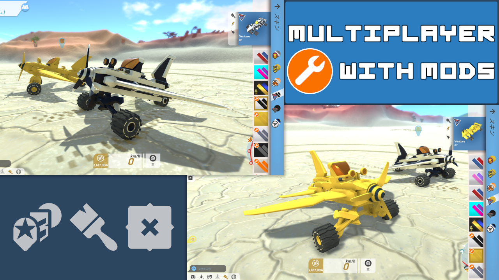

### About
Unofficial Bugfix patch for [TerraTech](https://store.steampowered.com/app/285920/TerraTech/).  
This patch that allows Steam Workshop Mods to be used in co-op.

### Posts in TerraTech forum
- [friends cannot see mods in co-op](https://forum.terratechgame.com/index.php?threads/friends-cannot-see-mods-in-co-op.22502/)
- [[1.4.21] [PC] (Modded) Skins are not working for co-op players.](https://forum.terratechgame.com/index.php?threads/1-4-21-pc-modded-skins-are-not-working-for-co-op-players.23187/)

### Steam Workshop Link
- [Multiplayer Mod Patch](https://steamcommunity.com/sharedfiles/filedetails/?id=3139179410)
